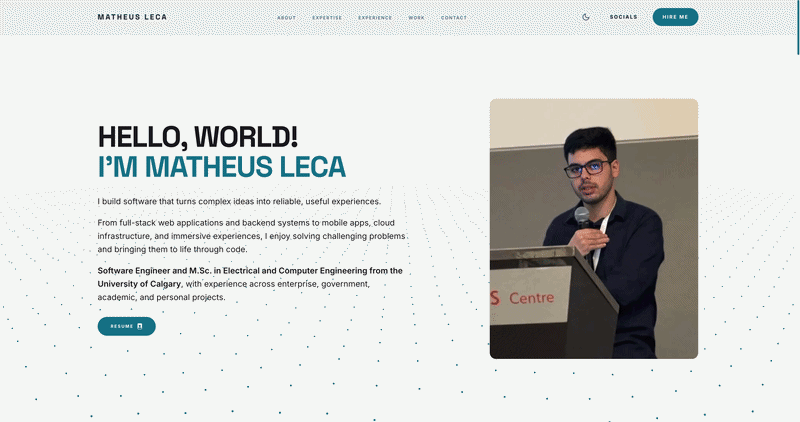

# Landing Page — personal portfolio

Single-page portfolio of Matheus Leca, Software Engineer.

**Live:** [matheusleca.dev](https://matheusleca.dev)

### Desktop Preview



### Mobile Preview

<p align="center">
  
</p>

## Contents

- [About](#about)
- [Features](#features)
- [Tech stack](#tech-stack)
- [Setup](#setup)
- [Deployment variables](#deployment-variables)
- [Commands](#commands)

## About

A single-page portfolio presenting Matheus Leca's background, skills, experience,
and selected work, with a contact form for roles and project inquiries.

## Features

- Light/dark theme toggle persisted in `localStorage`
- Typewriter hero, scroll progress bar, scroll-reveal sections
- Vanta DOTS hero background that follows the theme and skips reduced-motion
- Embla work carousel with keyboard and swipe support
- Responsive layout from mobile to wide desktop
- Contact form with validation, spam protection, and mailto fallback

## Tech stack

| | |
|---|---|
| Framework | Next.js 16, React 19, TypeScript 5 |
| Styling | Tailwind CSS 4 plus hand-written CSS for themes, animations, and motion guards |
| Contact | Cloudflare Worker (primary), optional Firebase callable, Resend via HTTPS |
| Tooling | ESLint, Vitest + Testing Library, Wrangler |
| Hosting | Firebase Hosting static export |

## Setup

```bash
npm ci
npm run dev
```

## Deployment variables

The Firebase workflow reads each value from secrets first, then variables:

| Variable | Required | Purpose |
| -------- | -------- | ------- |
| `FIREBASE_SERVICE_ACCOUNT_MY_PORTFOLIO_874E7` | Yes (secret) | Service account key with Firebase Hosting Admin |
| `NEXT_PUBLIC_FIREBASE_*` | Yes | Public Firebase web config baked into the build |
| `NEXT_PUBLIC_SITE_URL` | No (defaults to `https://matheusleca.dev`) | Canonical URL for sitemap, robots, and metadata |
| `NEXT_PUBLIC_CONTACT_ENDPOINT` | No | Contact Worker URL; falls back to `/api/contact` |
| `NEXT_PUBLIC_RECAPTCHA_SITE_KEY` | Only for the Firebase callable path | reCAPTCHA v3 site key for App Check |

## Commands

| Command | Description |
| ------- | ----------- |
| `npm test` | Run the test suite |
| `npm run lint` | Run ESLint |
| `npx tsc --noEmit` | Type check |
| `npm run build:static` | Static export into `out/` |
| `npm run deploy:worker` | Deploy the contact Worker |
| `npm run deploy:functions` | Build + deploy the Cloud Function (Blaze plan) |
